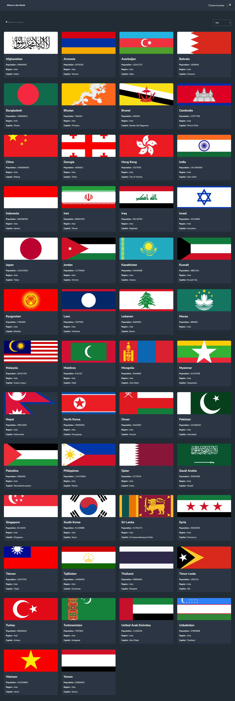
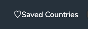

# 📝 Countries App - Version 5 Project by Rucha Nimbalkar

## [Github Repo](https://github.com/ruchanimbalkar/countries-app-fall-2025/tree/main/version-5)

## 🚀 Live Site

Check out the app: https://countries-version-5-september-2025.netlify.app/

## 📌 Project Description & Purpose

### Description

This project is countries App Version 5.
This project uses the free REST countries API to render data about all the countries in the world.
On the home page, user can see cards for each country showing the flad, country name, population, region and capital.

### Purpose

This project demonstrates my skills in Front End and Back End using HTML, CSS, JavaScript, REACT, postgreSQL, Node.js and Express.js respectively.
This is a project I worked on as a part of my training at Annie Cannons when I was a backend trainee. This is a full stack app.

## ✨ Features

## This is what you can do on the app:

- You can view all the countries in the world
- You can sort the countries by region.
- You can view a particular country
- You can view a particular country
- You can delete saved countries

### Home Page See all countries.

[](https://countries-version-5-september-2025.netlify.app/)

### You can sort the countries by region.


Following example shows countries in the continent Asia.


You can also look up a country by typing its unofficial name in the search bar.

Following example shows countries in the continent Asia.


### You can view a particular country

When you click on a country, on the home page, it takes you to the country detail page. It shows information about the country and gives you the button to save or unsave the country. Moreover, it also shows the times the country was viewed. You can also reset the count to zero by clicking the button.


You can click the back button to go back to the home page.

### You can view saved countries

If you click the Saved Counntries link in the header, it takes you to the Saved Countries page.



The saved countries page shows countries that have been saved in the database, the last added user and a form for new user to register.
There is also a delete button to delete all the saved countries.


### You can delete saved countries

I added conditional rendering for SavedCountries page. I want the delete button and saved countries page to render when there are in fact countries saved in the database. If there are no countries saved in the database, it should show message “You have zero saved countries”. Once the saved coountries are rendered because there are in fact countries saved in the database, and the user clicks the delete button. The countries are deleted from the database and the message “Deleted saved countries. You have zero saved countries” is rendered on the web page.

## 🛠️ Tech Stack

**Frontend**

- **Languages:** **HTML, CSS, JavaScript**
- **Framework:** **REACT**
- **Deployment:** **Netlify**

**Server/API**

- **Languages:** **Node.js**
- **Framework:** **Express.js**
- **Deployment:** **Render**

**Database**

- **Languages:** **postgreSQL**
- **Deployment:** **NEON**

## 🔹 API Documentation

These are the API endpoints I built:

1. GET /get-all-users Retrieves all users from the database.
2. GET /get-newest-user Retrieves the most recently added user.
3. POST /add-one-user Adds a new user to the database.
4. POST /update-one-country-count Updates (or initializes) the view count of a country.
5. POST /save-one-country Saves a country if it hasn’t already been saved.
6. POST /unsave-one-country Unsaves a country if it has been saved.
7. POST /reset-one-country-count // resets country's count to zero
8. POST /unsave-all-countries deletes all saved countries

[Learn more about the API endpoints here](/api-documentation.md)

## 🗄️ Database Schema

Here’s the SQL I used to create my tables:

```sql
CREATE TABLE users(
  user_id SERIAL PRIMARY KEY,
  name VARCHAR NOT NULL,
  country_name VARCHAR NOT NULL,
  email VARCHAR UNIQUE NOT NULL,
  bio VARCHAR NOT NULL
);
```

---

```sql
CREATE TABLE saved_countries (
	saved_country_id SERIAL PRIMARY KEY,
    country_name VARCHAR UNIQUE NOT NULL
);
```

---

```sql
CREATE TABLE country_counts(
	country_count_id SERIAL PRIMARY KEY,
  	country_name VARCHAR UNIQUE NOT NULL,
    count INTEGER NOT NULL
);
```

## 💭 Reflections

**What I learned:** **How to develop a full stack project**

**What I'm proud of:** **Completeing the project and truing the stretch goals**

**What challenged me:The stretch goals and day/night mode challenged me.**

**Future ideas for how I'd continue building this project:**

1. Add user login form so users can save their own countries
2. Add bordering countries to country detail page
3. Refacto code for toggle

## 🙌 Credits & Shoutouts

Thanks to **\_\_Professor Arianna\_\_** for making this a fun and easy learning process !
And thanks to **\_\_Bakari\_\_** and **\_\_Makiba\_\_** for guiding and supporting during my learning!
